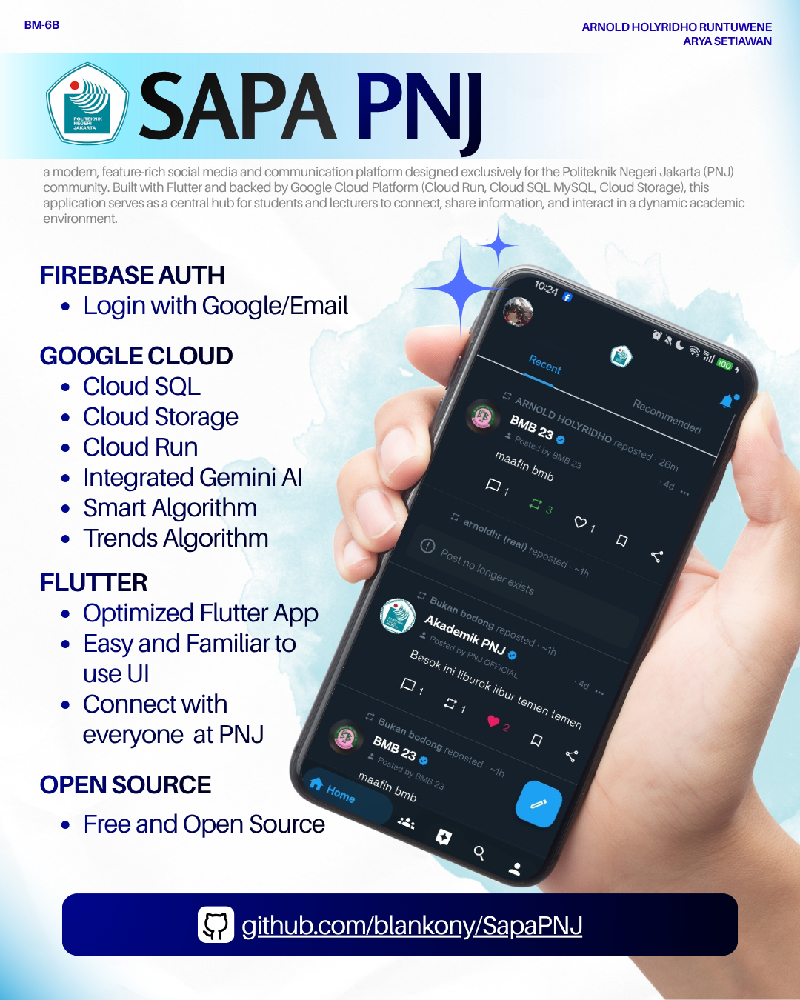
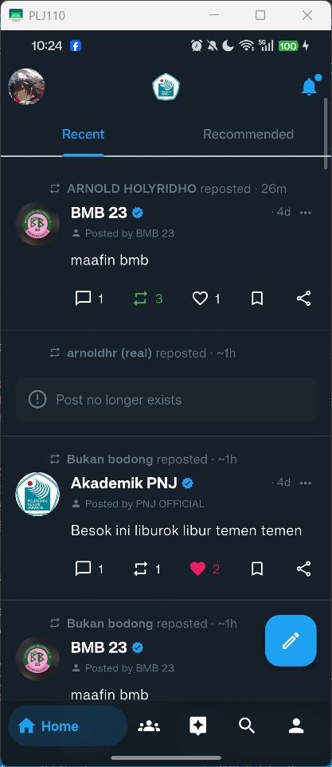
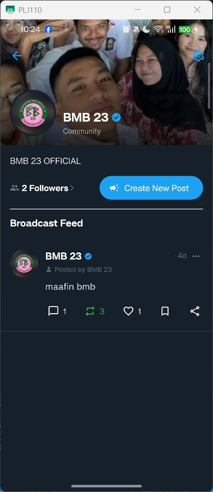
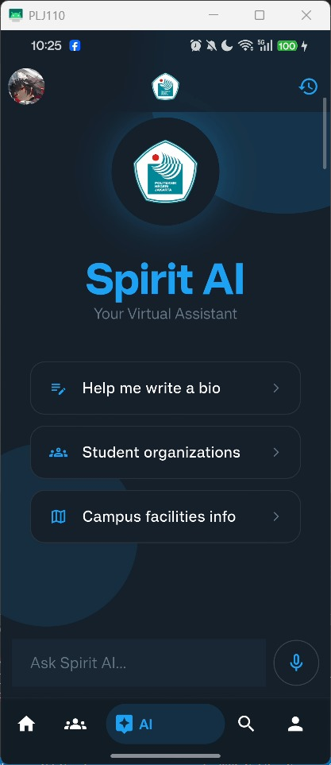

<p align="center">
  
</p>

# SAPA PNJ

**SAPA PNJ** is a modern, feature-rich social media and communication platform designed exclusively for the Politeknik Negeri Jakarta (PNJ) community. Built with Flutter and backed by Google Cloud Platform (Cloud Run, Cloud SQL MySQL, Cloud Storage), this application serves as a central hub for students and lecturers to connect, share information, and interact in a dynamic academic environment.

## Contributing

If you plan on making PRs or technical contributions to this repository, please ensure you review and strictly follow our **[Commit Rules & Style Guide](documents/COMMIT_RULES.md)** to maintain a clean and standardized commit history.

## Project Overview

This project is a comprehensive social platform that integrates advanced **Narrow AI** technologies to enhance user experience. It incorporates a sophisticated multi-step user onboarding process, AI-powered assistance using **Google Gemini**, content safety algorithms, and a real-time notification system. The architecture emphasizes denormalized data for a fast-reading feed, a secure authentication flow restricted to PNJ emails, and a personalized experience through department identification.

## Core Features

### 1. Artificial Intelligence (Narrow AI) Suite

The application leverages various Narrow AI technologies to perform specific intelligent tasks:

- **Generative AI Chatbot (Spirit AI):** An intelligent virtual assistant powered by `Google Gemini 2.5 Flash` capable of answering campus queries, translation, and drafting text with context retention.
- **Visual Detector AI (Content Safety):** An automated image scanning system using AI to detect and block sensitive content (violence, adult content) before upload.
- **Smart Voice Command & TTS:**
  - **Voice Search:** Speech-to-Text integration for hands-free navigation and searching.
  - **Text-to-Speech (TTS):** The assistant can read responses aloud with automatic language detection (ID/EN).
- **Predictive Text Engine:** A custom **Markov Chain** algorithm that learns the user's writing style to suggest the next word while typing.
- **Algorithmic Feed & Trending:** Statistical AI and heuristic algorithms (`N-gram analysis`) to detect trending topics and personalize content discovery based on engagement.

### 2. Trust & Safety System

- **KTM Verification (Blue Badge):** Users can upload their Student ID Card (KTM) to get a "Verified Student" badge, ensuring a trusted ecosystem.
- **Bad Word Guard:** Real-time text filtering system that prevents the posting of offensive language or hate speech.
- **Moderation Tools:** Comprehensive reporting system and user blocking capabilities to maintain a healthy community.

### 3. Community Hub & Management

- **Community Groups:** Dedicated spaces for Student Activity Units (UKM) or Departments.
- **Role-Based Access:** Support for **Admins** and **Editors** to manage community pages.
- **Official Broadcasts:** "Post as Community" feature allowing admins to publish official announcements under the organization's identity.

### 4. Social & Real-time Interaction

- **Rich Media Posting:** Support for image cropping and video trimming/compression.
- **Draft System:** Save posts locally to finish editing later.
- **Privacy Controls:** Set post visibility to Public, Followers Only, or Private.
- **Social Graph:** Connect with friends via Follow/Unfollow system and "Friends of Friends" recommendations.

### 5. Authentication & Onboarding

- **Exclusive Registration:** Restricted to official PNJ student emails (`@stu.pnj.ac.id`).
- **Secure Auth:** Full support for login, registration, and password reset via Firebase Auth.
- **Guided Setup:** Multi-step onboarding for profile and academic data setup.

### 6. Media & Optimization

- **Google Cloud Storage (GCS):** Media uploads are handled via signed-URL Cloud Functions and stored in a GCS bucket for optimized delivery and reduced server load.
- **Offline Capabilities:** Local caching using Shared Preferences for settings and basic data.

## Screenshots

Here is a sneak peek of the application. For the complete list of all 47 screenshots covering every feature, please visit the **[Screenshot Gallery](documents/gallery.md)**.

| Home Feed                                     | Community                                               | AI Assistant                                       | User Profile                                           |
| --------------------------------------------- | ------------------------------------------------------- | -------------------------------------------------- | ------------------------------------------------------ |
|  |  |  |  |

**[Click here to view the full Screenshot Gallery](documents/gallery.md)**

---

## Getting Started

Firebase, Google Cloud, and API key configuration is required before running the
application.

### 1. Firebase Project Setup

- **Create a Firebase Project:** Go to the [Firebase Console](https://console.firebase.google.com/) and create a new project.
- **Add FlutterApp:** Follow the setup guide to connect your Flutter application.
- **Enable Services:**
  - **Authentication:** Enable the `Email/Password` sign-in provider.

### 2. Google Cloud Runtime Configuration (`gcloud.conf`)

All deploy-specific Google Cloud and Firebase client values live in
`gcloud.conf`. Edit this file when moving the app to another GCP/Firebase
project; do not edit Dart source files for project IDs, Firebase app IDs,
bucket names, or backend URLs.

At minimum, verify these values before building or deploying:

```env
GCP_PROJECT_ID=your-gcp-project-id
GCP_REGION=asia-southeast2
GCP_SERVICE_ACCOUNT=sapapnj-media-fn

GCS_BUCKET_NAME=your-gcs-bucket-name
GCS_FUNCTION_URL=https://REGION-PROJECT_ID.cloudfunctions.net

API_SERVICE_NAME=sapapnjapi
API_FUNCTION_NAME=sapapnjApi
API_BASE_URL=https://your-api-base-url

DB_NAME=sapapnj
DB_USER=sapapnj-api
DB_INSTANCE=sapapnj-db
INSTANCE_CONNECTION_NAME=PROJECT_ID:REGION:DB_INSTANCE

FIREBASE_PROJECT_ID=your-firebase-project-id
FIREBASE_MESSAGING_SENDER_ID=your-sender-id
FIREBASE_STORAGE_BUCKET=your-firebase-storage-bucket
```

Also replace the platform-specific `FIREBASE_*_API_KEY`,
`FIREBASE_*_APP_ID`, auth domain, measurement ID, and bundle ID entries with
the values from your Firebase project.

For Android Google Sign-In, also replace `android/app/google-services.json`
with the file downloaded from the same Firebase project. The Dart Firebase
options now come from `gcloud.conf`, but Android still uses
`google-services.json` for native Google Sign-In resources.

### 3. Secret Client Configuration (`.env`)

This project uses `flutter_dotenv` for client-side secrets and optional local
overrides. Create a `.env` file in the root directory before building the app.
Keep deploy/project routing in `gcloud.conf`; keep API secrets here.

```.env
# Google AI Studio Key (for Spirit AI & Content Safety)
GEMINI_API_KEY=your_google_gemini_api_key
```

Do not place server-only secrets such as `DB_PASS` in `.env`, because Flutter
assets are bundled into the client build. Export server secrets only in the
shell used for deployment.
