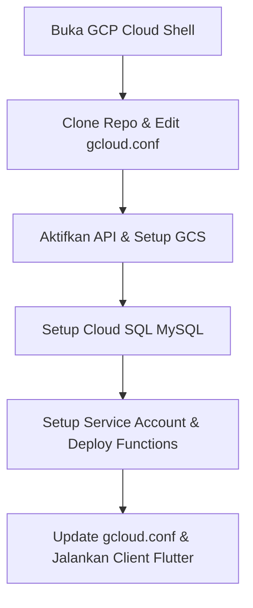

# Panduan Lengkap Deployment NewSapaPNJ via GCP Cloud Shell

Panduan ini dirancang khusus untuk menguji (test deploy) backend **NewSapaPNJ** menggunakan **GCP Cloud Shell** ke region **asia-southeast2 (Jakarta)** milik Anda sendiri, dengan **tetap menggunakan konfigurasi Firebase bawaan**. Anda tidak perlu melakukan setup proyek Firebase baru.

Berikut adalah nama resource GCP tetap yang digunakan dalam panduan ini:
- **GCP Project ID**: `newsapapnj-gcp`
- **Region**: `asia-southeast2` (Jakarta)
- **Database Instance**: `newsapapnj-db`
- **Database Name**: `newsapapnj`
- **Database User**: `newsapapnj-api`
- **Database Password**: `newsapapnj-db-pass`
- **Storage Bucket**: `newsapapnj-media-assets`
- **Service Account**: `newsapapnj-media-fn`

---

## Alur Singkat Deployment


---

## Langkah 1: Buka GCP Cloud Shell & Clone Project

1. Buka Cloud Shell melalui link ini: <https://shell.cloud.google.com>
2. Pastikan Cloud Shell Anda terhubung ke Project ID GCP Anda (**`newsapapnj-gcp`**):
   ```bash
   gcloud config set project "newsapapnj-gcp"
   ```
3. Clone repository SapaPNJ ke dalam Cloud Shell dan masuk ke foldernya:
   ```bash
   git clone https://github.com/blankony/SapaPNJ.git
   cd SapaPNJ
   ```

---

## Langkah 2: Edit Konfigurasi `gcloud.conf`

Buka file konfigurasi proyek menggunakan editor teks `nano` di terminal Cloud Shell:
```bash
nano gcloud.conf
```

Pastikan nilai resource GCP diatur seperti di bawah ini, dan **biarkan konfigurasi `FIREBASE_*` bawaan cloning tetap apa adanya**:
```env
GCP_PROJECT_ID=newsapapnj-gcp
GCP_REGION=asia-southeast2
GCP_SERVICE_ACCOUNT=newsapapnj-media-fn

GCS_BUCKET_NAME=newsapapnj-media-assets
GCS_FUNCTION_URL=https://asia-southeast2-newsapapnj-gcp.cloudfunctions.net

API_SERVICE_NAME=newsapapnjapi
API_FUNCTION_NAME=newsapapnjApi
API_BASE_URL=https://asia-southeast2-newsapapnj-gcp.cloudfunctions.net/newsapapnjApi

DB_NAME=newsapapnj
DB_USER=newsapapnj-api
DB_INSTANCE=newsapapnj-db
INSTANCE_CONNECTION_NAME=newsapapnj-gcp:asia-southeast2:newsapapnj-db

# BIARKAN FIREBASE VALUE DI BAWAH INI TETAP SEPERTI ASLINYA (BAWAAN CLONING)
FIREBASE_PROJECT_ID=myfirebaseproject-c8c85
```
Simpan file dengan menekan `Ctrl + O`, tekan `Enter`, lalu keluar dengan `Ctrl + X`.

---

## Langkah 3: Load Config & Aktifkan API GCP

Jalankan perintah ini di terminal Cloud Shell untuk memuat konfigurasi dan mengaktifkan service API GCP:
```bash
set -a
source gcloud.conf
set +a

gcloud services enable storage.googleapis.com \
  cloudfunctions.googleapis.com \
  cloudbuild.googleapis.com \
  run.googleapis.com \
  sqladmin.googleapis.com \
  sql-component.googleapis.com
```
*(Pastikan akun billing GCP Anda sudah terhubung ke proyek `newsapapnj-gcp` ini di Cloud Console).*

---

## Langkah 4: Membuat & Mengonfigurasi Cloud Storage

Jalankan perintah-perintah ini untuk membuat bucket media dan mengatur CORS:
```bash
# 1. Membuat bucket di region Jakarta
gcloud storage buckets create "gs://newsapapnj-media-assets" \
  --location="asia-southeast2" \
  --default-storage-class=STANDARD \
  --uniform-bucket-level-access

# 2. Memberikan akses baca publik
gcloud storage buckets add-iam-policy-binding "gs://newsapapnj-media-assets" \
  --member=allUsers \
  --role=roles/storage.objectViewer

# 3. Membuat konfigurasi CORS
cat > cors.json <<EOF
[
  {
    "origin": ["*"],
    "method": ["GET", "PUT", "POST", "HEAD"],
    "responseHeader": ["Content-Type", "Content-Length"],
    "maxAgeSeconds": 3600
  }
]
EOF

# 4. Terapkan CORS ke bucket
gcloud storage buckets update "gs://newsapapnj-media-assets" --cors-file=cors.json
```

---

## Langkah 5: Setup Database Cloud SQL MySQL

Jalankan perintah ini untuk membuat instance database, database baru, dan user API:
```bash
# 1. Membuat instance database MySQL (Proses ini memakan waktu sekitar 5-10 menit)
gcloud sql instances create "newsapapnj-db" \
  --database-version=MYSQL_8_0 \
  --tier=db-f1-micro \
  --region="asia-southeast2" \
  --storage-type=SSD \
  --storage-size=10GB \
  --availability-type=zonal \
  --assign-ip


NAME: newsapapnj-db
DATABASE_VERSION: MYSQL_8_0
LOCATION: asia-southeast2-b
TIER: db-f1-micro
PRIMARY_ADDRESS: 34.101.162.7
PRIVATE_ADDRESS: -
STATUS: RUNNABLE


# 2. Membuat database 'newsapapnj'
gcloud sql databases create "newsapapnj" --instance="newsapapnj-db"

# 3. Membuat user database dengan password 'newsapapnj-db-pass'
gcloud sql users create "newsapapnj-api" \
  --instance="newsapapnj-db" \
  --password="newsapapnj-db-pass"
```

### Mengisi Skema Database langsung dari Cloud Shell
1. Sambungkan Cloud Shell ke database Anda:
   ```bash
   gcloud sql connect "newsapapnj-db" --user="newsapapnj-api"
   ```
2. Masukkan password database Anda: **`newsapapnj-db-pass`** saat diminta.
3. Setelah masuk ke terminal MySQL, jalankan perintah ini:
   ```sql
   USE newsapapnj;
   ```
4. Salin (copy) seluruh kode SQL dari file [schema.sql](file:///D:/Kuliah/Semester%206/Big%20Data%20Cloud%20Computing/TEST%20DEPLOY%20SAPA%20PNJ/SapaPNJ/cloud_functions/api/schema.sql) di komputer lokal Anda, lalu **paste** ke dalam terminal MySQL tersebut dan tekan enter.
5. Ketik `exit` dan tekan enter untuk keluar dari mysql client.

---

## Langkah 6: Setup Service Account & Akses Izin

Buat service account dan berikan semua izin peran (role) yang diperlukan untuk penyimpanan dan akses database:
```bash
# 1. Membuat service account
gcloud iam service-accounts create "newsapapnj-media-fn" \
  --display-name="NewSapaPNJ Backend Services"

# 2. Memberikan izin Storage Admin
gcloud projects add-iam-policy-binding "newsapapnj-gcp" \
  --member="serviceAccount:newsapapnj-media-fn@newsapapnj-gcp.iam.gserviceaccount.com" \
  --role="roles/storage.admin"

# 3. Memberikan izin Token Creator
gcloud projects add-iam-policy-binding "newsapapnj-gcp" \
  --member="serviceAccount:newsapapnj-media-fn@newsapapnj-gcp.iam.gserviceaccount.com" \
  --role="roles/iam.serviceAccountTokenCreator"

# 4. Memberikan izin Cloud SQL Client
gcloud projects add-iam-policy-binding "newsapapnj-gcp" \
  --member="serviceAccount:newsapapnj-media-fn@newsapapnj-gcp.iam.gserviceaccount.com" \
  --role="roles/cloudsql.client"
```

---

## Langkah 7: Deploy Backend dari Cloud Shell

### A. Deploy Media Helper Functions
Jalankan perintah ini untuk menginstal dependensi dan mendeploy fungsi media ke region Jakarta:
```bash
cd cloud_functions/media
npm install

gcloud functions deploy getSignedUploadUrl \
  --gen2 \
  --runtime=nodejs22 \
  --region="asia-southeast2" \
  --trigger-http \
  --allow-unauthenticated \
  --entry-point=getSignedUploadUrl \
  --set-env-vars="GCS_BUCKET_NAME=newsapapnj-media-assets" \
  --service-account="newsapapnj-media-fn@newsapapnj-gcp.iam.gserviceaccount.com" \
  --source=.

gcloud functions deploy deleteObject \
  --gen2 \
  --runtime=nodejs22 \
  --region="asia-southeast2" \
  --trigger-http \
  --allow-unauthenticated \
  --entry-point=deleteObject \
  --set-env-vars="GCS_BUCKET_NAME=newsapapnj-media-assets" \
  --service-account="newsapapnj-media-fn@newsapapnj-gcp.iam.gserviceaccount.com" \
  --source=.
```

---

### B. Deploy REST API Gateway (Cloud Run)
Jalankan perintah ini untuk mendeploy API gateway SapaPNJ ke Google Cloud Run:
```bash
cd ../api
npm install

export DB_PASS="newsapapnj-db-pass"
chmod +x deploy.sh
./deploy.sh
```

---

## Langkah 8: Konfigurasi Client (Lokal Anda)

gcloud run services list --project=newsapapnj-gcp --region=asia-southeast2

Setelah deployment selesai di Cloud Shell:
1. Salin file `gcloud.conf` hasil editan Anda di Cloud Shell ke folder proyek lokal Anda.
2. Buat file `.env` di komputer lokal Anda pada root folder proyek NewSapaPNJ, dan masukkan API key Google Gemini Anda:
   ```env
   GEMINI_API_KEY=YOUR_GEMINI_API_KEY
   ```
   *(Bisa didapatkan secara gratis di [Google AI Studio](https://aistudio.google.com/)).*
3. Gunakan file `google-services.json` bawaan cloning yang sudah ada di lokal Anda.
4. Jalankan aplikasi Flutter Anda secara lokal:
   ```bash
   flutter pub get
   flutter run
   ```

---
